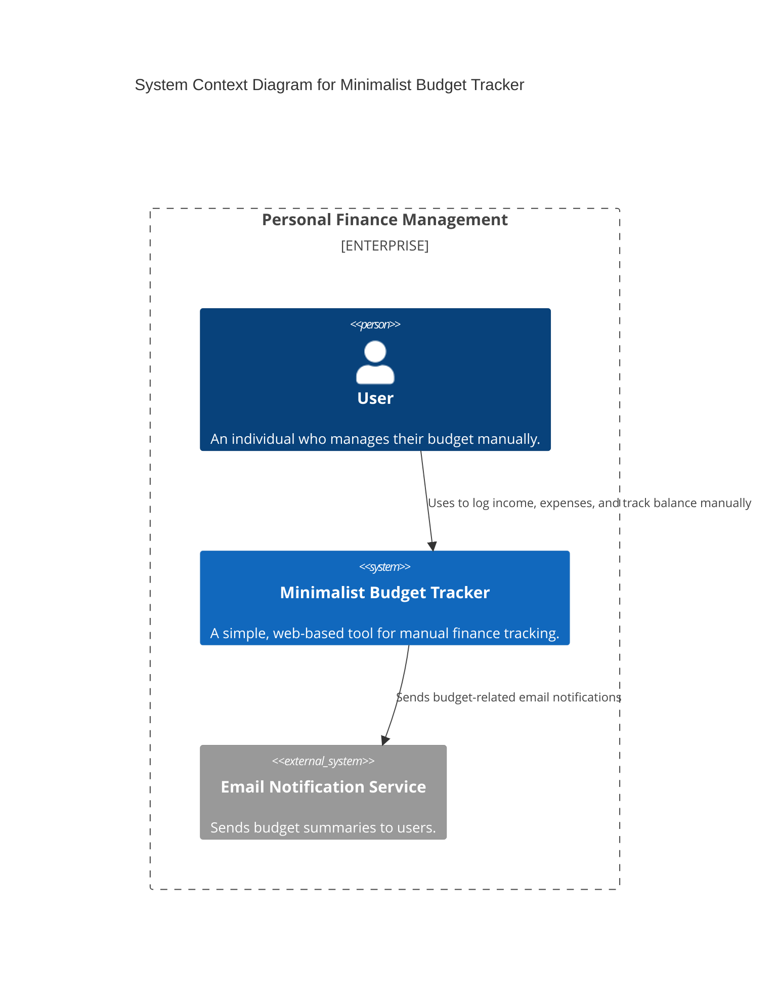
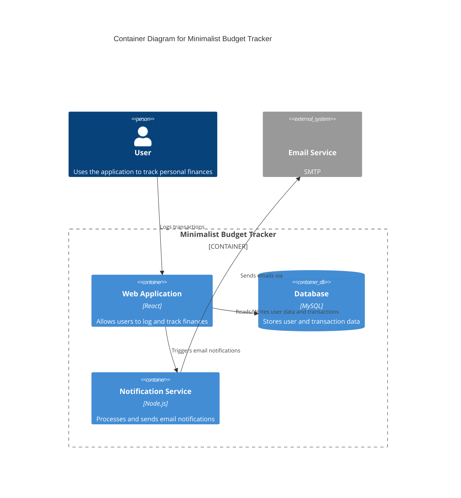
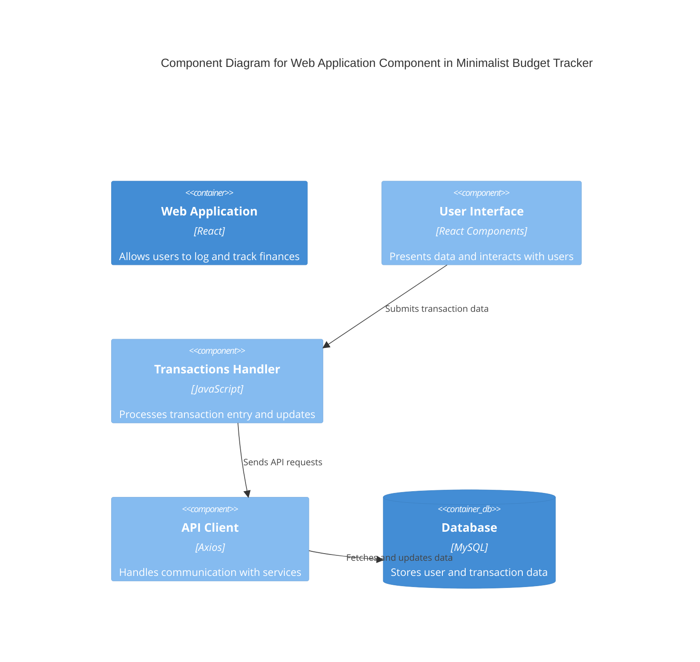

# 🏗️ Architecture Overview

## 📄 File: Architecture.md

### 📌 Description
This document outlines the **architectural structure** of the 🏦 Minimalist Budget Tracker. It provides a clear visualization of how the system is organized and how its components interact with each other. The architecture follows the **C4 Model**, which includes different levels of system abstraction to improve clarity and maintainability.

### 📊 What Will Be Covered
**🌍 Context Diagram** – Shows how the Budget Tracker interacts with users and external systems.

**📦 Container Diagram** – Breaks down the system into frontend, backend, and database components.

**🧩 Component Diagram** – Explores the internal structure of key application modules.

