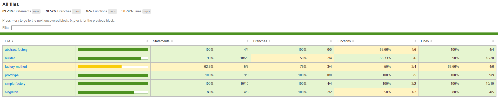

## TEST_COVERAGE REPORT
 
 

The unit tests were written using **Jest** to verify the correct implementation of all six creational design patterns in the Budget Tracker project. Each test file checks for:

- Correct object creation
- Proper initialization of attributes
- Handling of edge cases (e.g., invalid inputs, singleton enforcement)

 
 

