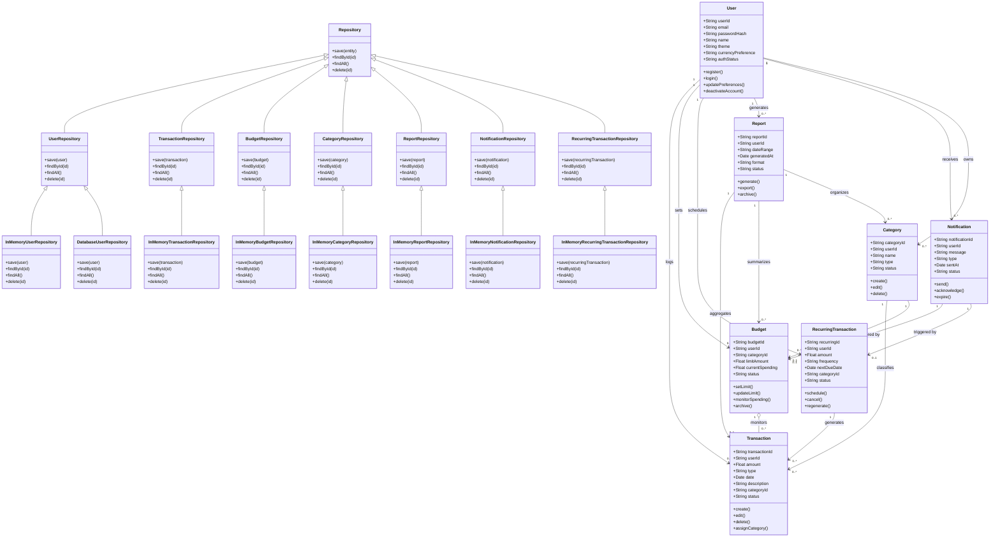

## UPDATED CLASS DIAGRAM INCLUDING REPOISOTORY INTERFACES AND IMPLEMENTATIONS

 
 

```mermaid

classDiagram
    %% User Class
    class User {
        +String userId
        +String email
        +String passwordHash
        +String name
        +String theme
        +String currencyPreference
        +String authStatus
        +register()
        +login()
        +updatePreferences()
        +deactivateAccount()
    }

    %% Transaction Class
    class Transaction {
        +String transactionId
        +String userId
        +Float amount
        +String type
        +Date date
        +String description
        +String categoryId
        +String status
        +create()
        +edit()
        +delete()
        +assignCategory()
    }

    %% Category Class
    class Category {
        +String categoryId
        +String userId
        +String name
        +String type
        +String status
        +create()
        +edit()
        +delete()
    }

    %% Budget Class
    class Budget {
        +String budgetId
        +String userId
        +String categoryId
        +Float limitAmount
        +Float currentSpending
        +String status
        +setLimit()
        +updateLimit()
        +monitorSpending()
        +archive()
    }

    %% Recurring Transaction Class
    class RecurringTransaction {
        +String recurringId
        +String userId
        +Float amount
        +String frequency
        +Date nextDueDate
        +String categoryId
        +String status
        +schedule()
        +cancel()
        +regenerate()
    }

    %% Report Class
    class Report {
        +String reportId
        +String userId
        +String dateRange
        +Date generatedAt
        +String format
        +String status
        +generate()
        +export()
        +archive()
    }

    %% Notification Class
    class Notification {
        +String notificationId
        +String userId
        +String message
        +String type
        +Date sentAt
        +String status
        +send()
        +acknowledge()
        +expire()
    }

    %% Repository Interfaces
    class Repository {
        +save(entity)
        +findById(id)
        +findAll()
        +delete(id)
    }

    class UserRepository {
        +save(user)
        +findById(id)
        +findAll()
        +delete(id)
    }

    class TransactionRepository {
        +save(transaction)
        +findById(id)
        +findAll()
        +delete(id)
    }

    class BudgetRepository {
        +save(budget)
        +findById(id)
        +findAll()
        +delete(id)
    }

    class CategoryRepository {
        +save(category)
        +findById(id)
        +findAll()
        +delete(id)
    }

    class ReportRepository {
        +save(report)
        +findById(id)
        +findAll()
        +delete(id)
    }

    class NotificationRepository {
        +save(notification)
        +findById(id)
        +findAll()
        +delete(id)
    }

    class RecurringTransactionRepository {
        +save(recurringTransaction)
        +findById(id)
        +findAll()
        +delete(id)
    }

    %% In-Memory Implementations
    class InMemoryUserRepository {
        +save(user)
        +findById(id)
        +findAll()
        +delete(id)
    }

    class InMemoryTransactionRepository {
        +save(transaction)
        +findById(id)
        +findAll()
        +delete(id)
    }

    class InMemoryBudgetRepository {
        +save(budget)
        +findById(id)
        +findAll()
        +delete(id)
    }

    class InMemoryCategoryRepository {
        +save(category)
        +findById(id)
        +findAll()
        +delete(id)
    }

    class InMemoryReportRepository {
        +save(report)
        +findById(id)
        +findAll()
        +delete(id)
    }

    class InMemoryNotificationRepository {
        +save(notification)
        +findById(id)
        +findAll()
        +delete(id)
    }

    class InMemoryRecurringTransactionRepository {
        +save(recurringTransaction)
        +findById(id)
        +findAll()
        +delete(id)
    }

    %% Future Database Implementations
    class DatabaseUserRepository {
        +save(user)
        +findById(id)
        +findAll()
        +delete(id)
    }

    %% Relationships and Multiplicities (Domain Model)
    User "1" --> "0..*" Transaction : logs
    User "1" --> "0..*" Budget : sets
    User "1" --> "0..*" RecurringTransaction : schedules
    User "1" --> "0..*" Report : generates
    User "1" --> "0..*" Notification : receives
    User "1" --> "0..*" Category : owns

    Category "1" --> "0..*" Transaction : classifies
    Category "1" --> "0..1" Budget : budgeted

    Budget "1" o-- "0..*" Transaction : monitors
    RecurringTransaction "1" --> "0..*" Transaction : generates
    Report "1" --> "0..*" Transaction : aggregates
    Report "1" --> "0..*" Budget : summarizes
    Report "1" --> "0..*" Category : organizes

    Notification "1" --> "0..1" Budget : triggered by
    Notification "1" --> "0..1" RecurringTransaction : triggered by

    %% Relationships (Repository Layer)
    Repository <|-- UserRepository
    Repository <|-- TransactionRepository
    Repository <|-- BudgetRepository
    Repository <|-- CategoryRepository
    Repository <|-- ReportRepository
    Repository <|-- NotificationRepository
    Repository <|-- RecurringTransactionRepository

    UserRepository <|-- InMemoryUserRepository
    TransactionRepository <|-- InMemoryTransactionRepository
    BudgetRepository <|-- InMemoryBudgetRepository
    CategoryRepository <|-- InMemoryCategoryRepository
    ReportRepository <|-- InMemoryReportRepository
    NotificationRepository <|-- InMemoryNotificationRepository
    RecurringTransactionRepository <|-- InMemoryRecurringTransactionRepository

    UserRepository <|-- DatabaseUserRepository

```
