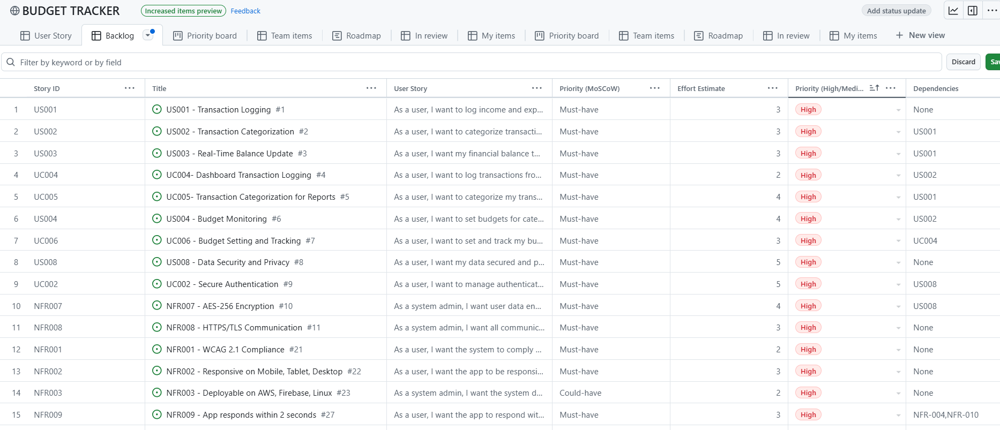
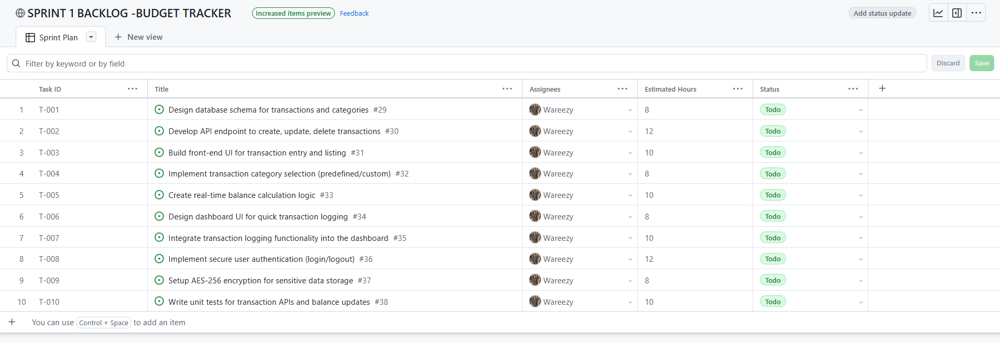

## AGILE PLANNING DOCUMENT (ALL ARTIFACTS)

 
 

## User Stories Table
- [GITHUB-TOOLS: USER_STORIES_TABLE](https://github.com/users/Wareezy/projects/9)
 
 

## User Stories Table-Screenshot

 
 

## Product Backlog Table
 

- [Github Tools -Product Backlog Table](https://github.com/users/Wareezy/projects/9/views/1)
 
 

## Product Backlog Table - Screenshot

 
 

## Sprint Backlog Table:

- [GITHUB-TOOLS: SPRINT BACKLOG TABLE](https://github.com/users/Wareezy/projects/10)
 
 

## Sprint BackLog Table-Screenshot:

