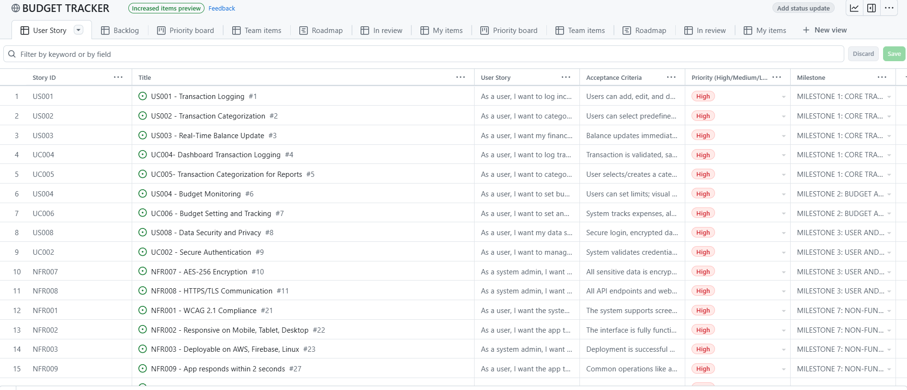

## User Stories Table
- [GITHUB-TOOLS: USER_STORIES_TABLE](https://github.com/users/Wareezy/projects/9)
 
 

## User Stories Table-Screenshot

 
 

## Markdown Table Versions

 

## Functional Requirements - User Stories

 

| Story ID | User Story | Acceptance Criteria | Priority |
|--------|-----------|---------------------|---------|
| US001 | As a user, I want to log income and expense transactions so that I can track my finances easily. | Users can add, edit, and delete transactions; transactions update the list accurately. | High |
| US002 | As a user, I want to categorize transactions so that I can analyze my spending by category. | Users can select predefined or create custom categories; categories reflect in reports. | High |
| US003 | As a user, I want my financial balance to update in real time so that I always know my current balance. | Balance updates immediately on adding, editing, or deleting a transaction and syncs across devices. | High |
| US004 | As a user, I want to set budgets for categories so that I can monitor and control my spending. | Users can set limits; visual warnings show when limits are exceeded. | High |
| US005 | As a user, I want to schedule recurring transactions so that I don't have to log them manually every time. | Users define frequency; system auto-logs them as scheduled. | Medium |
| US006 | As a user, I want to receive notifications for important financial events so that I stay informed. | Alerts for bills, budget warnings, and summaries are sent via email or app; users can manage preferences. | Medium |
| US007 | As a user, I want to generate financial reports so that I can review my income, expenses, and budgets. | Users can view reports by time range and export as PDF/CSV. | Medium |
| US008 | As a user, I want my data secured and private so that I can trust the system with my financial info. | Secure login, encrypted data storage. | High |
| US009 | As a user, I want my data synced across devices so that I can access my budget anywhere. | Data syncs within 5 seconds of adding a transaction. | Medium |
| US010 | As a user, I want to customize my preferences so that the app works the way I like. | Users change currency, mode, and notification settings instantly. | Low |

## Use Cases - User Stories

| Story ID | User Story | Acceptance Criteria | Priority |
|--------|-----------|---------------------|---------|
| UC001 | As a user, I want to contact support easily so that I can resolve any issues I encounter. | System provides contact channels; support reps respond and update the ticket. | Medium |
| UC002 | As a user, I want to manage authentication securely so that my account is protected. | System validates credentials, supports OAuth/MFA, and logs auth history. | High |
| UC003 | As a marketing team, I want to analyze user engagement so that I can improve user retention. | System displays user activity data and trends in a dashboard. | Low |
| UC004 | As a user, I want to log transactions from my dashboard so that my finances stay up-to-date. | Transaction is validated, saved, and balance updates with confirmation. | High |
| UC005 | As a user, I want to categorize my transactions so that reports display meaningful summaries. | User selects/creates a category and it reflects in reports. | High |
| UC006 | As a user, I want to set and track my budget so that I stay within my financial goals. | System tracks expenses, alerts user if 80% of budget is exceeded. | High |
| UC007 | As a user or financial advisor, I want to generate financial reports so that I can analyze finances. | Reports generate with summaries and allow export to PDF/CSV. | Medium |
| UC008 | As a system, I want to notify users about key financial events so that users stay informed. | Trigger events send notifications based on user settings. | Medium |

## Non-Functional Requirements - User Stories

- As a user, I want the system to comply with WCAG 2.1 so that users with disabilities can access it.
- As a user, I want the app to be responsive on all devices so that I can use it on mobile, tablet, or desktop.
- As a system admin, I want the system deployable on AWS, Firebase, and Linux so that hosting is flexible.
- As a developer, I want the system to be modular and documented so that updates and debugging are easier.
- As a system admin, I want logging and monitoring enabled so that I can track system health and errors.
- As a user, I want the system to handle up to 10,000 users so that it performs well under high load.
- As a system admin, I want user data encrypted with AES-256 so that security compliance is met.
- As a system admin, I want all communications secured with HTTPS/TLS so that data is protected in transit.
- As a user, I want the app to respond within 2 seconds so that I can use it without delays.
- As a developer, I want database queries optimized within 500ms so that the system runs efficiently.

