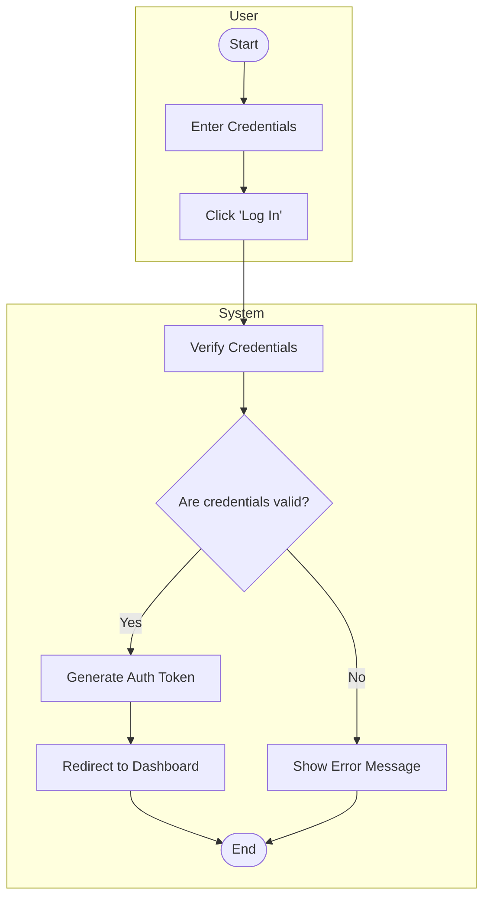
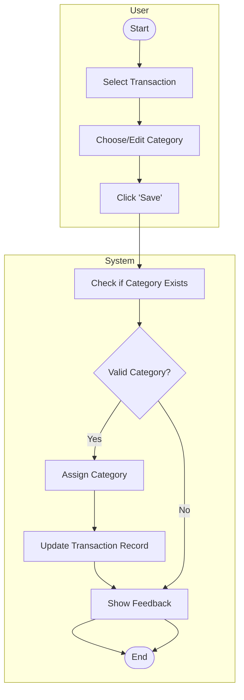
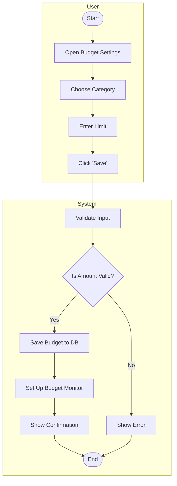
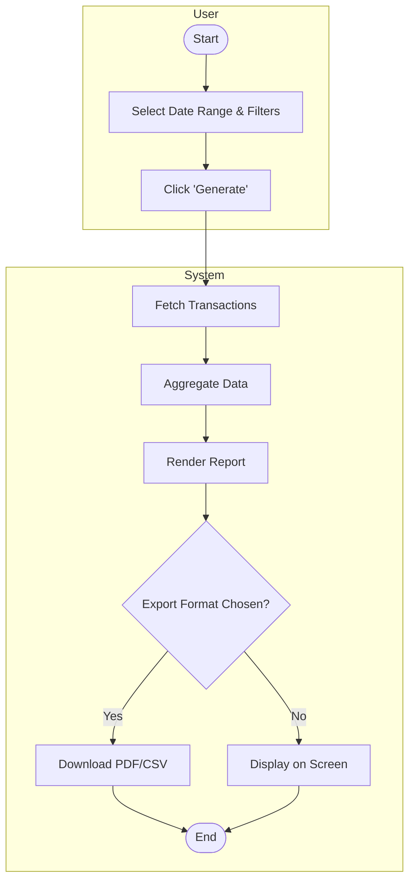
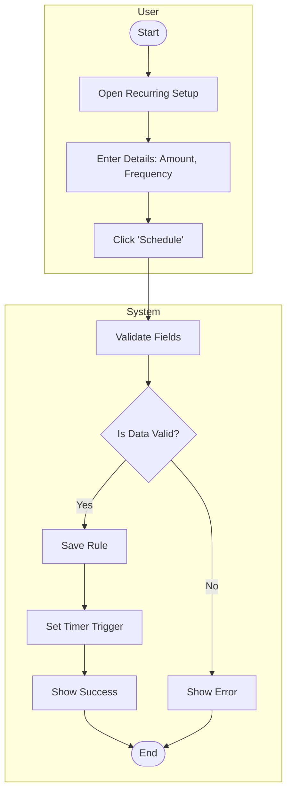

## 🔐 1. User Registration

 
 

 
 

## 🔑 2. User Login

 
 

## 🧾 3. Add a Transaction

 
 

 
 

## 🗂️ 4. Categorize a Transaction

 
 

 
 

## 💰 5. Set a Budget

 
 

## 📊 6. Generate Financial Report

 
 

## 🔁 7. Schedule a Recurring Transaction

 
 

 
 

## 🔔 8. Receive Budget Exceeded Notification

