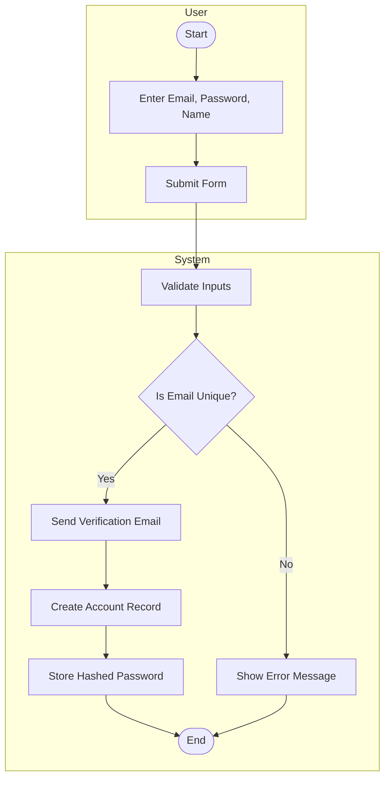
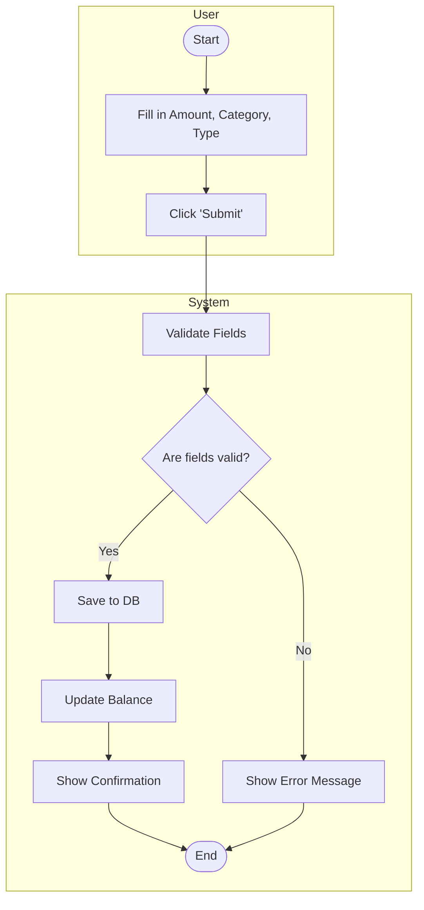
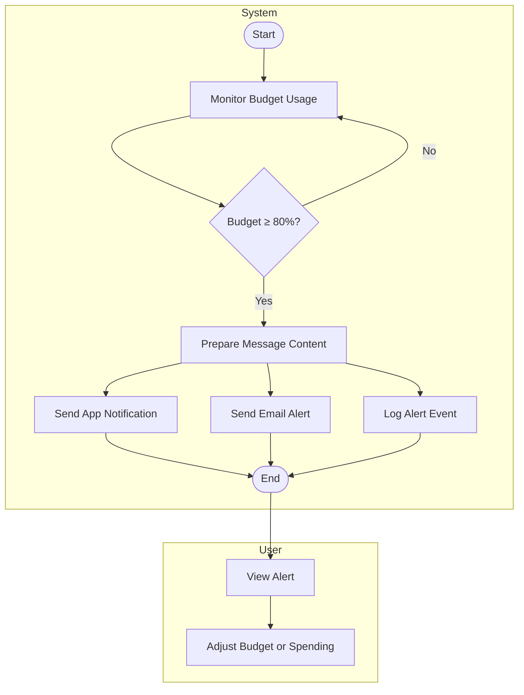

## ACTIVITY DIAGRAMS
 
 
## 🔐 1. User Registration

 
 

 
 
### 🧠 Explanation:

This workflow models how a user registers, and how the system handles input validation and secure data handling.

#### 🔄 Key Actions:
- User fills in credentials → system checks if email is unique.
- If valid, account is created and verification email is sent.

#### 🎯 Stakeholder Mapping:
- Addresses **FR-008** (data security, hashed passwords).
- Aligns with **UC002** (secure authentication).
- Ensures scalability via validation and email confirmation.
- Meets usability expectations by providing immediate feedback.

 
 

## 🔑 2. User Login

 
 

### 🧠 Explanation:

This workflow models secure user login. It validates credentials and returns a session token.

#### 🎯 Functional Mapping:
- ✅ **FR-008**: Secure login
- ✅ **UC002**: Manage authentication securely

#### 👥 Stakeholder Value:
- Supports concerns around **data protection**
- Provides **error feedback** for invalid login attempts

 
 

## 🧾 3. Add a Transaction

 
 

 
 

### 🧠 Explanation:

Captures the process of recording a new transaction.

#### 🎯 Functional Mapping:
- ✅ **FR-001**: Log transactions
- ✅ **FR-003**: Real-time balance updates

#### 👥 Stakeholder Value:
- Ensures integrity and usability by validating inputs before updating the balance.

 
 

## 🗂️ 4. Categorize a Transaction

 
 

 
 

### 🧠 Explanation:

Models the categorization of a transaction for better reporting.

#### 🎯 Functional Mapping:
- ✅ **FR-002**: Categorize by spending type
- ✅ **UC005**: Improve reporting by category

#### 👥 Stakeholder Value:
- Supports goals for **data clarity** and **user personalization**.

 
 

## 💰 5. Set a Budget

 
 

### 🧠 Explanation:

Models the workflow for creating a category-specific budget.

#### 🎯 Functional Mapping:
- ✅ **FR-004**: Users can set budget limits
- ✅ **UC006**: System tracks expenses vs. budget

#### 👥 Stakeholder Value:
- Ensures input validation and feedback, addressing **data integrity concerns**.

 
 

## 📊 6. Generate Financial Report

 
 

### 🧠 Explanation:

Covers how reports are created and optionally exported.

#### 🎯 Functional Mapping:
- ✅ **FR-007**: Generate PDF/CSV reports
- ✅ **UC007**: Financial advisor reporting

#### 👥 Stakeholder Value:
- Supports the need for **insight** and **data-driven decisions**.

 
 

## 🔁 7. Schedule a Recurring Transaction

 
 

 
 

### 🧠 Explanation:

Handles setting up recurring entries (e.g., rent, salary).

#### 🎯 Functional Mapping:
- ✅ **FR-005**: Schedule auto-transactions
- ✅ **FR-003**: Ensures balance stays updated

#### 👥 Stakeholder Value:
- Supports **automation** and reduces **manual logging workload**.

 
 

## 🔔 8. Receive Budget Exceeded Notification

 
 

🧠 Explanation:

Represents the alert process when spending nears or exceeds the budget.

Maps to:
✅ FR-006: Budget limit notifications
✅ UC008: Event-based system messages

Helps users stay informed and act early, fulfilling stakeholder needs for proactive alerts.

---
