## 🔐 1. User Registration

 
 

 
 

## 🔑 2. User Login

 
 

## 🧾 3. Add a Transaction

 
 

 
 

## 🗂️ 4. Categorize a Transaction

 
 

 
 

## 💰 5. Set a Budget

 
 

## 📊 6. Generate Financial Report

 
 

## 🔁 7. Schedule a Recurring Transaction

 
 

 
 

## 🔔 8. Receive Budget Exceeded Notification

```mermaid

flowchart TD
    subgraph System
        A1[Monitor Budget Usage]
        A2{Budget ≥ 80%?}
        A3[Trigger Notification Event]
        A4[Prepare Message Content]
        A5[Send via Email/App]
        A6[End]
    end

    subgraph User
        B1[View Alert]
        B2[Adjust Budget or Spending]
    end

    A1 --> A2
    A2 -- Yes --> A3 --> A4 --> A5 --> A6 --> B1 --> B2
    A2 -- No --> A1

```

