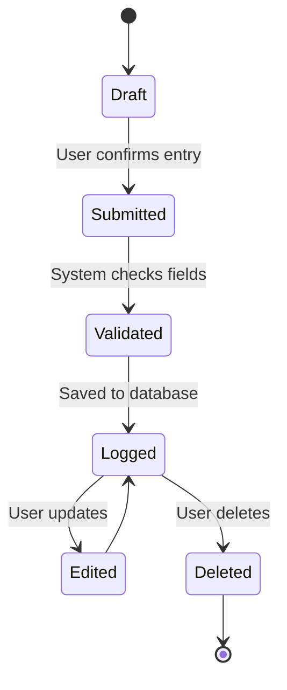
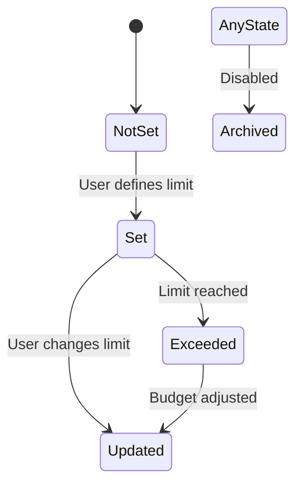
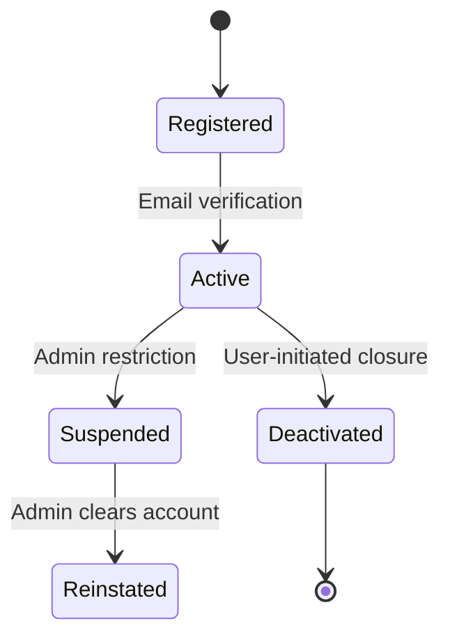

<br>
<br>
<br>



<br>
<br>
<br>



<br>
<br>


<br>
<br>

```mermaid

stateDiagram-v2
    [*] --> Unauthenticated
    Unauthenticated --> Authenticating : User logs in
    Authenticating --> Authenticated : Credentials valid
    Authenticating --> Unauthenticated : Failed attempt
    Authenticated --> Expired : Token timeout
    Expired --> Unauthenticated

``
