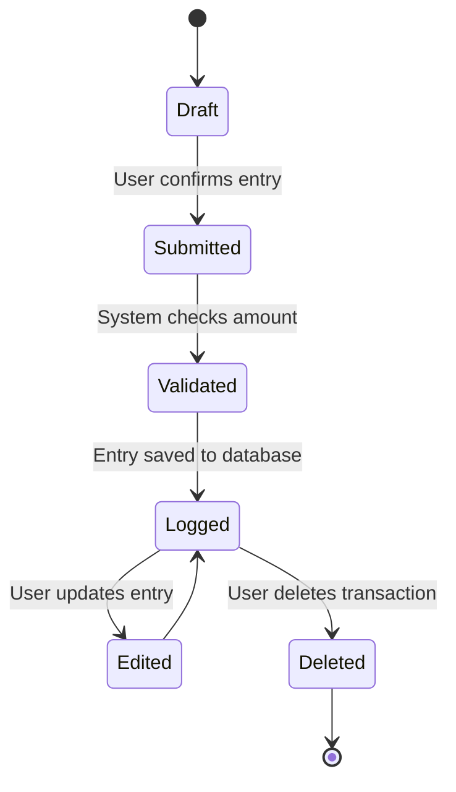
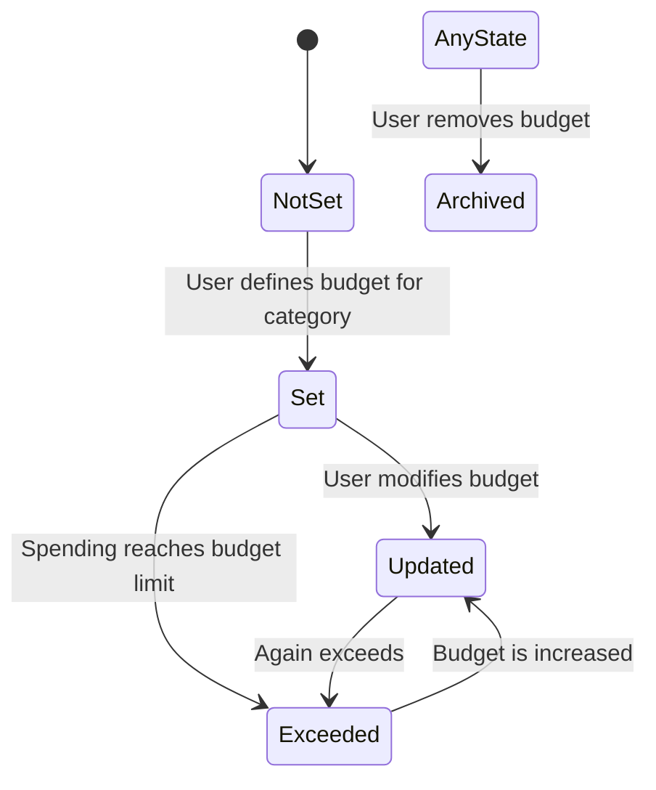
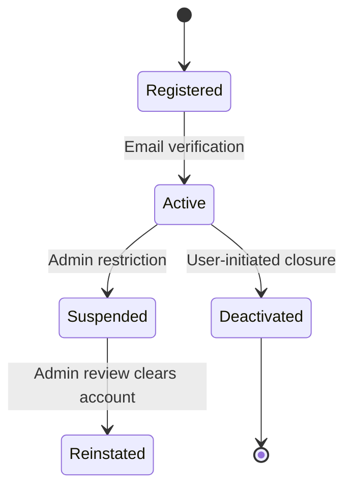

```mermaid

stateDiagram-v2
    [*] --> Draft
    Draft --> Submitted : User confirms entry
    Submitted --> Validated : System checks amount
    Validated --> Logged : Entry saved to database
    Logged --> Edited : User updates entry
    Logged --> Deleted : User deletes transaction
    Edited --> Logged
    Deleted --> [*]

```
<br>
<br>
<br>


```mermaid

stateDiagram-v2
    [*] --> NotSet
    NotSet --> Set : User defines budget for category
    Set --> Updated : User modifies budget
    Set --> Exceeded : Spending reaches budget limit
    Exceeded --> Updated : Budget is increased
    Updated --> Exceeded : Again exceeds
    AnyState --> Archived : User removes budget

```

<br>
<br>
<br>


```mermaid

stateDiagram-v2
    [*] --> Registered
    Registered --> Active : Email verification
    Active --> Suspended : Admin restriction
    Active --> Deactivated : User-initiated closure
    Suspended --> Reinstated : Admin review clears account
    Deactivated --> [*]

```


```mermaid


