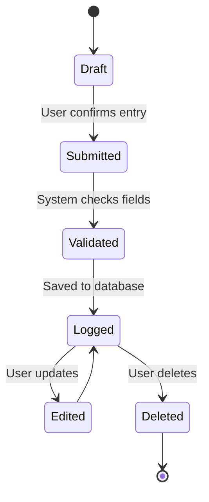
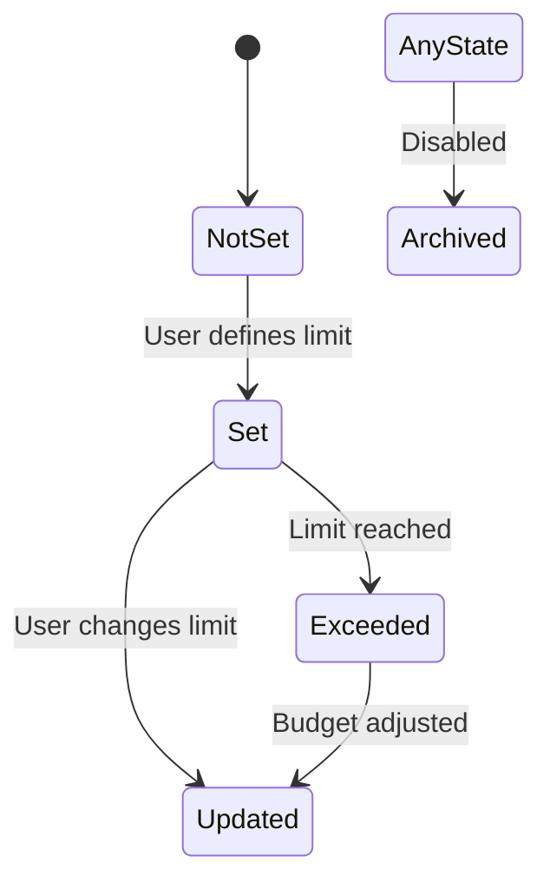
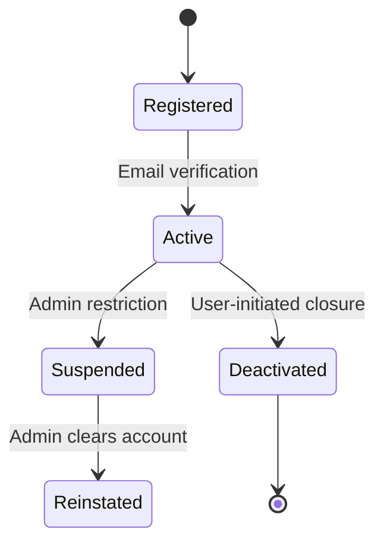
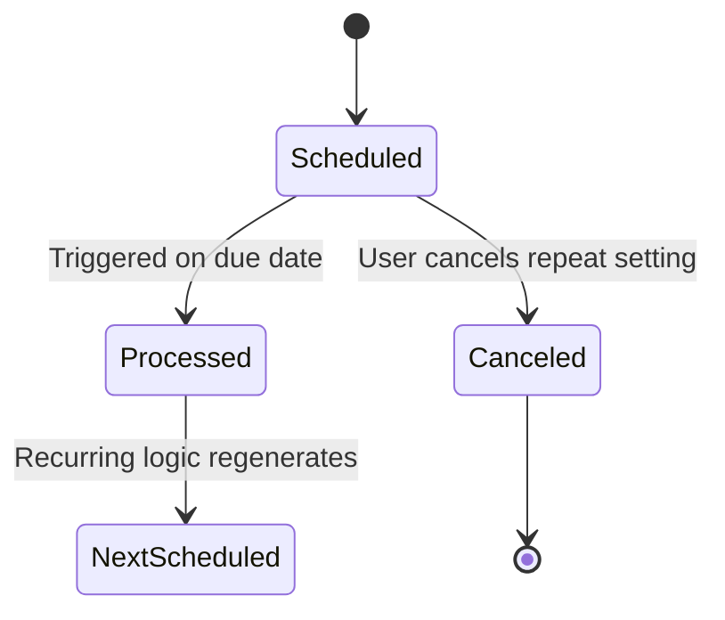
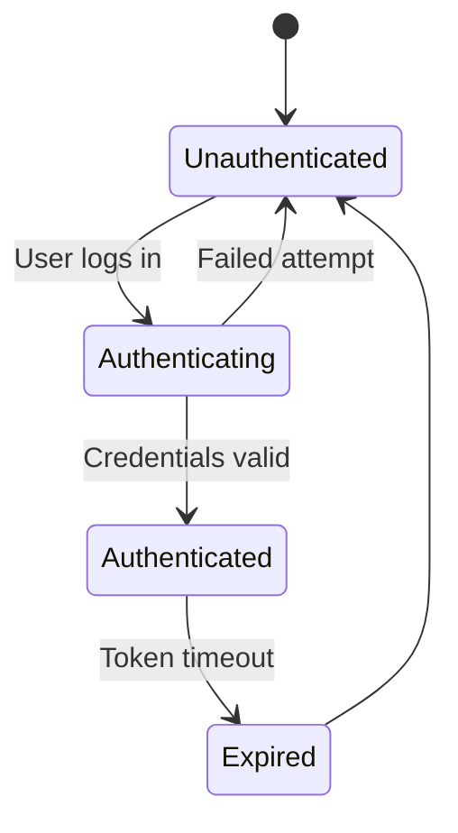
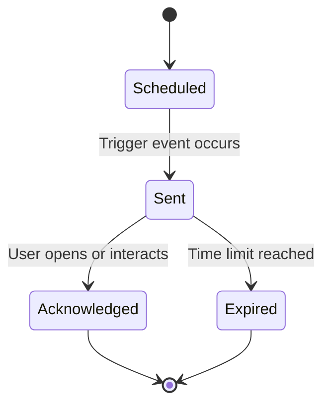
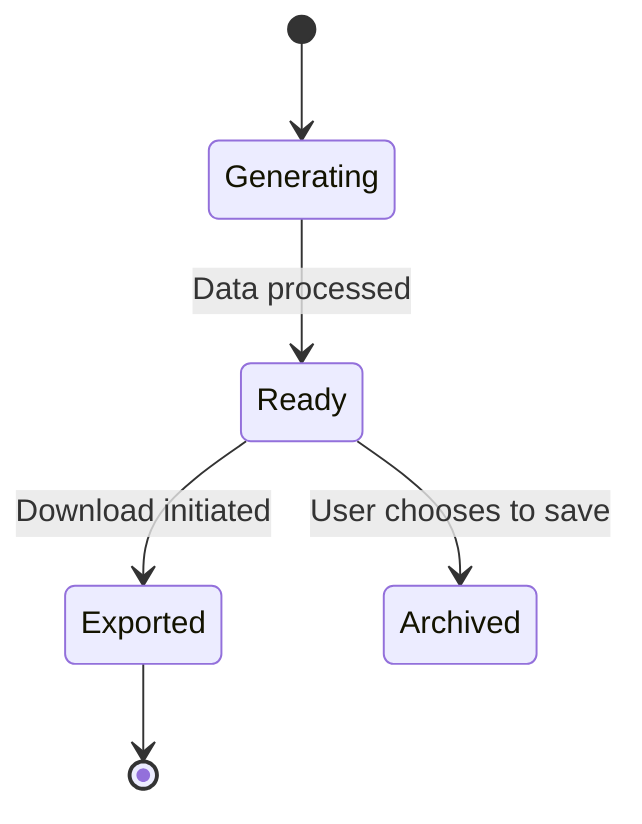
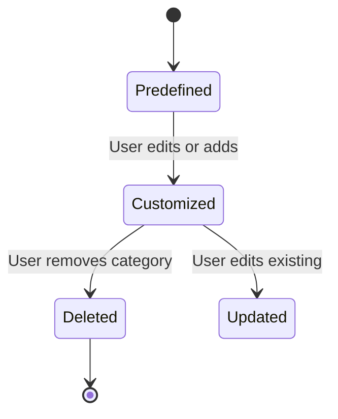

 
 

## 🧠 Explanation

### 🔑 Key States:

- **Draft**: Transaction is started but not yet finalized.  
- **Submitted**: User confirms the transaction details.  
- **Validated**: System performs checks on fields like amount and category.  
- **Logged**: The transaction is stored and affects the account balance.  
- **Edited**: User updates the saved entry.  
- **Deleted**: Entry is removed by the user.  

### 🔄 Key Transitions:

- **Draft → Submitted**: User confirms transaction.  
- **Submitted → Validated**: System checks validation rules.  
- **Validated → Logged**: Transaction stored after passing validation.  
- **Logged → Edited/Deleted**: User modifies or deletes the entry.  

---

### ✅ Functional Requirement Mapping:

- **FR-001**: Log income/expense transactions.  
- **FR-003**: Update balance in real-time after transaction is logged.  
- **UC004**: Users can submit/edit transactions.  
- **FR-007**: Logged entries are used for reporting.  

 
 
 

 
 
 

 
 

 
 

 
 
 

 
 

