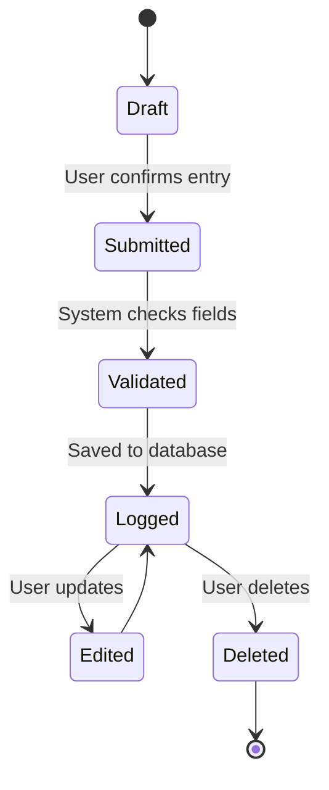
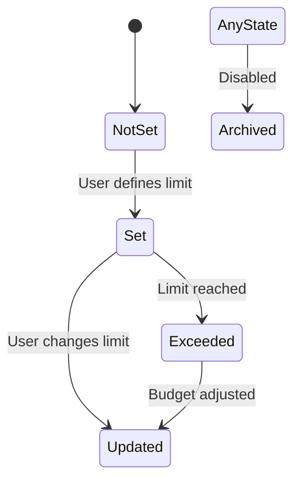
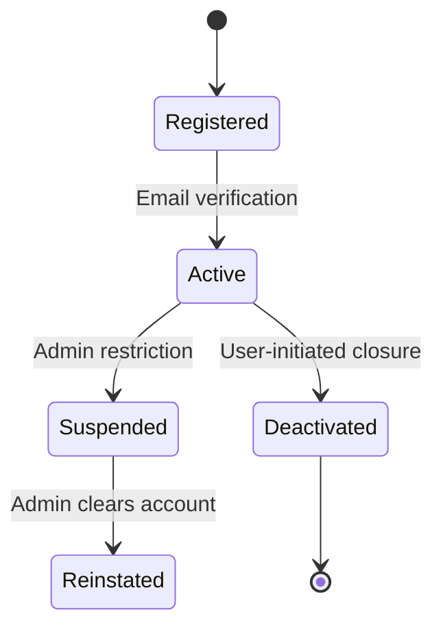
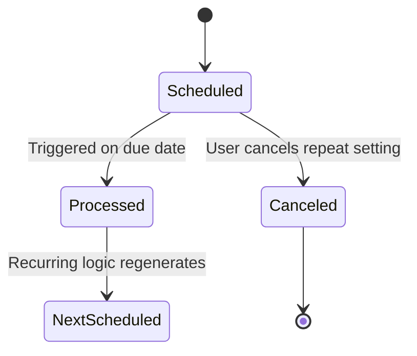
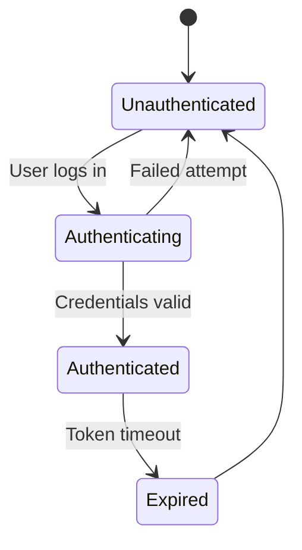
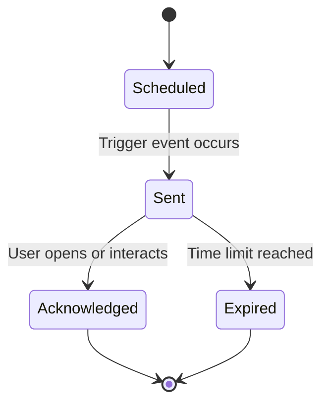
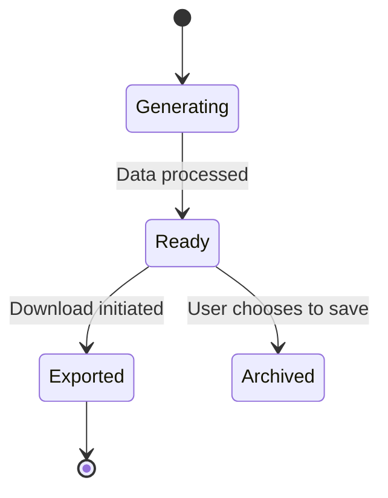
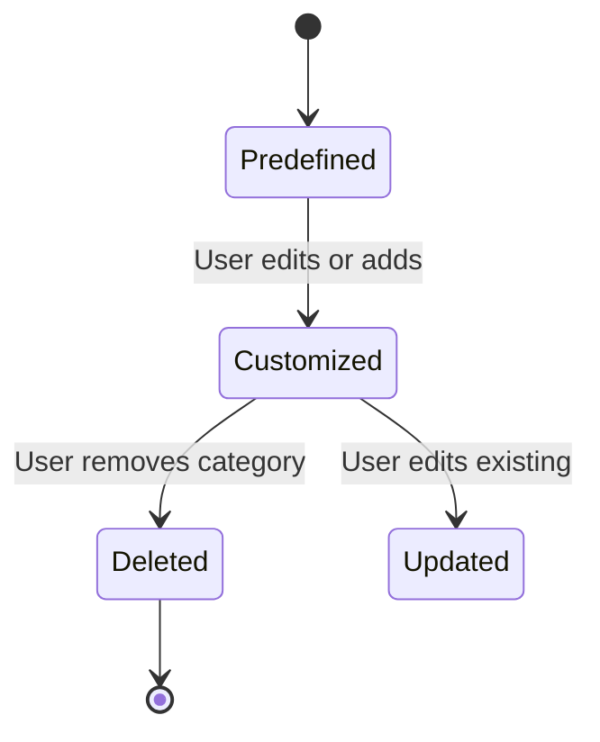

## 🧾 Transaction

 
 

## 🧠 Explanation

### 🔑 Key States:

- **Draft**: Transaction is started but not yet finalized.  
- **Submitted**: User confirms the transaction details.  
- **Validated**: System performs checks on fields like amount and category.  
- **Logged**: The transaction is stored and affects the account balance.  
- **Edited**: User updates the saved entry.  
- **Deleted**: Entry is removed by the user.  

### 🔄 Key Transitions:

- **Draft → Submitted**: User confirms transaction.  
- **Submitted → Validated**: System checks validation rules.  
- **Validated → Logged**: Transaction stored after passing validation.  
- **Logged → Edited/Deleted**: User modifies or deletes the entry.  

---

### ✅ Functional Requirement Mapping:

- **FR-001**: Log income/expense transactions.  
- **FR-003**: Update balance in real-time after transaction is logged.  
- **UC004**: Users can submit/edit transactions.  
- **FR-007**: Logged entries are used for reporting.  

 
 
 

## 2. 💰 Budget

 
 

 
 

## 🧠 Explanation

### 🔑 Key States:

- **NotSet**: No budget defined yet.  
- **Set**: A budget has been assigned to a category.  
- **Exceeded**: Spending has passed the limit.  
- **Updated**: User adjusted the budget.  
- **Archived**: Budget is no longer being used.  

### 🔄 Key Transitions:

- **NotSet → Set**: Initial setup of budget.  
- **Set → Exceeded**: Triggered by reaching 100% spending.  
- **Exceeded → Updated**: User increases or adjusts the budget.  
- **Any → Archived**: Budget is disabled or deleted.  

---

### ✅ Functional Requirement Mapping:

- **FR-004**: Budgeting capabilities.  
- **UC006**: Budget monitoring and alerts.  
- **FR-006**: Alerts triggered when budget is exceeded.  
- **FR-010**: Enable/disable budget preferences.  

 
 
 

## 3. 👤 User Account

 
 

 
 

## 🧠 Explanation

### 🔑 Key States:

- **Registered**: User account created but unverified.  
- **Active**: Account fully operational after verification.  
- **Suspended**: Temporarily disabled due to policy violation.  
- **Deactivated**: Closed by user.  
- **Reinstated**: Admin reactivates a suspended account.  

### 🔄 Key Transitions:

- **Registered → Active**: Verification completed.  
- **Active → Suspended**: Admin action due to issues.  
- **Active → Deactivated**: Voluntary deactivation.  
- **Suspended → Reinstated**: Admin lifts suspension.  

---

### ✅ Functional Requirement Mapping:

- **FR-008**: Secure user accounts.  
- **UC002**: Secure authentication.  
- **NFR007**: Encrypted user information.  
- **NFR006**: Handle account lifecycle at scale.  

 
 

## 4. 🔁 Recurring Transaction

 
 

 
 

## 🧠 Explanation

### 🔑 Key States:

- **Scheduled**: A future transaction is queued.  
- **Processed**: The transaction is executed.  
- **NextScheduled**: Another instance is scheduled automatically.  
- **Canceled**: User ends the recurring transaction.  

### 🔄 Key Transitions:

- **Scheduled → Processed**: Triggered by scheduled date.  
- **Processed → NextScheduled**: Recurrence logic re-applies.  
- **Scheduled → Canceled**: Recurrence removed by user.  

---

### ✅ Functional Requirement Mapping:

- **FR-005**: Automate recurring payments.  
- **FR-003**: Update balance after each recurrence.  

 
 

## 5. 🔐 Authentication Session

 
 

 
 

## 🧠 Explanation

### 🔑 Key States:

- **Unauthenticated**: Default when not logged in.  
- **Authenticating**: Login in progress.  
- **Authenticated**: User successfully logged in.  
- **Expired**: Session expired.  

### 🔄 Key Transitions:

- **Unauthenticated → Authenticating**: User starts login.  
- **Authenticating → Authenticated**: Valid credentials.  
- **Authenticating → Unauthenticated**: Login failure.  
- **Authenticated → Expired**: Token times out.  

---

### ✅ Functional Requirement Mapping:

- **UC002**: Secure login workflow.  
- **FR-008**: Secure authentication handling.  
- **NFR008**: Secure data transmission (HTTPS/TLS).  

 
 

## 6. 🔔 Notification

 
 

 
 

## 🧠 Explanation

### 🔑 Key States:

- **Scheduled**: Notification is queued.  
- **Sent**: Delivered to the user.  
- **Acknowledged**: User has seen or interacted.  
- **Expired**: Notification not acted upon.  

### 🔄 Key Transitions:

- **Scheduled → Sent**: Triggered by event (e.g. budget limit).  
- **Sent → Acknowledged**: User engages.  
- **Sent → Expired**: Time runs out.  

---

### ✅ Functional Requirement Mapping:

- **FR-006**: Notify users of events.  
- **UC008**: Alerts based on transactions and budgets.  

 
 

## 7. 📊 Report

 
 

 
 

## 🧠 Explanation

### 🔑 Key States:

- **Generating**: Report is being created.  
- **Ready**: Available to download or save.  
- **Exported**: User downloaded the file.  
- **Archived**: Saved for later viewing.  

### 🔄 Key Transitions:

- **Generating → Ready**: Report is complete.  
- **Ready → Exported**: User downloads it.  
- **Ready → Archived**: Saved to report history.  

---

### ✅ Functional Requirement Mapping:

- **FR-007**: Report generation.  
- **UC007**: Reports used for financial review or advice.  

 
 

## 8. 🗂️ Category

 
 

 
 

## 🧠 Explanation

### 🔑 Key States:

- **Predefined**: System-provided categories.  
- **Customized**: User-defined or modified categories.  
- **Deleted**: No longer in use.  

### 🔄 Key Transitions:

- **Predefined → Customized**: Edited or extended by user.  
- **Customized → Updated**: Modified by the user again.  
- **Customized → Deleted**: User removes the category.  

---

### ✅ Functional Requirement Mapping:

- **FR-002**: Categorize transactions.  
- **UC005**: Use categories in analytics.  
- **FR-010**: Support for user customization.  
