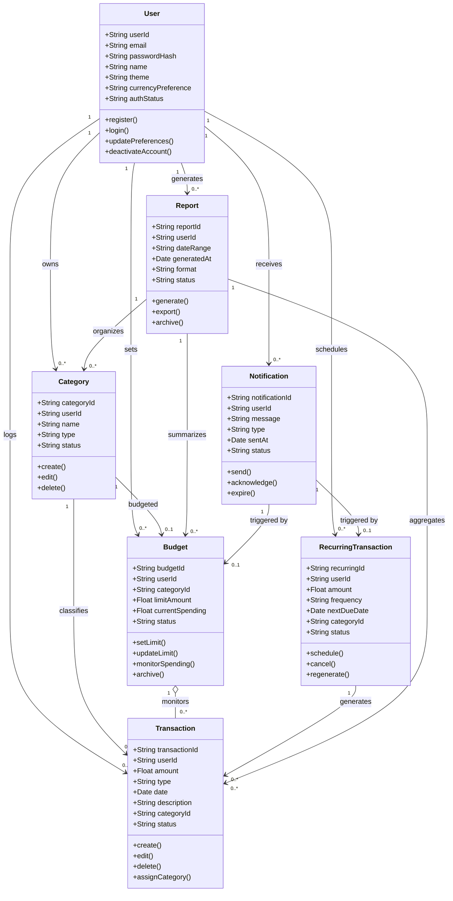

## 🧩 Class Diagram – Budget Tracker (Mermaid.js)

 
 

 
 
 

## 📌 Explanation of Design Decisions

- **User** is the central entity, owning all personal data and system interactions.

- **Transaction**, **Budget**, **Category**, and **RecurringTransaction** are tied directly to users and often interrelated.

- **Aggregation (`o--`)** is used where one entity logically monitors or summarizes many  
  _(e.g., Budget → Transaction, Report → Budget)_, but lifecycles are independent.

- **Composition** was avoided as no class’s lifecycle is strictly dependent on another  
  _(e.g., deleting a budget doesn't delete categories)_.

- **Multiplicity** clarifies cardinality:  
  A **User** has many **Transactions**, a **Category** may have one **Budget**, etc.

- **Reports** and **Notifications** are generated by the system but owned by the **User**, hence the use of associations.
