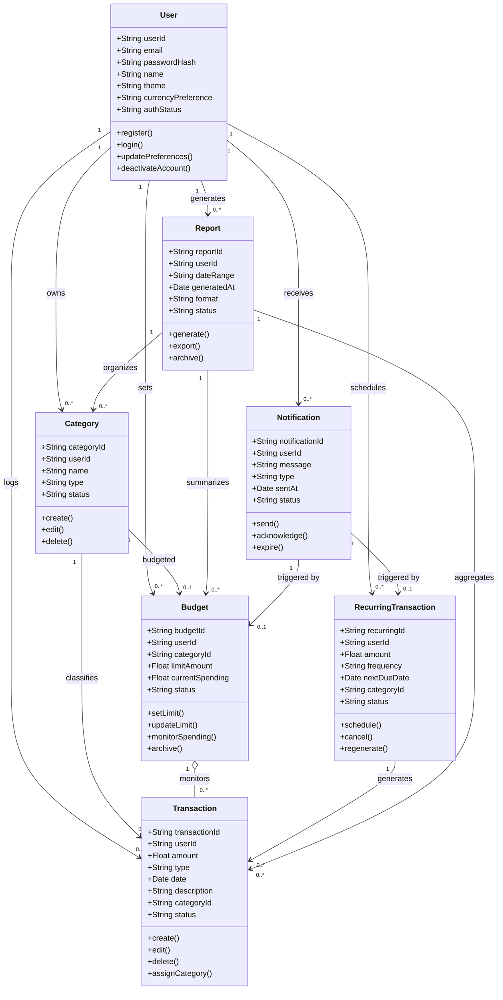

# 📦 Domain Model – Minimalist Budget Tracker

## 🧩 Entity Overview

| **Entity**               | **Attributes**                                                                                     | **Methods**                                                            | **Relationships**                                                                                   |
|--------------------------|----------------------------------------------------------------------------------------------------|------------------------------------------------------------------------|------------------------------------------------------------------------------------------------------|
| **User**                 | `userId`, `email`, `passwordHash`, `name`, `theme`, `currencyPreference`, `authStatus`            | `register()`, `login()`, `updatePreferences()`, `deactivateAccount()` | - Has many **Transactions** - Sets many **Budgets** - Owns **Categories** - Receives **Notifications** - Has many **RecurringTransactions** |
| **Transaction**          | `transactionId`, `userId`, `amount`, `type` (income/expense), `date`, `description`, `categoryId`, `status` | `create()`, `edit()`, `delete()`, `assignCategory()`                   | - Belongs to **User** - Linked to **Category** - Affects **Budget** - Used in **Reports**                      |
| **Category**             | `categoryId`, `userId`, `name`, `type` (predefined/custom), `status`                              | `create()`, `edit()`, `delete()`                                       | - Belongs to **User** - Categorizes many **Transactions** - Used in **Reports**                                    |
| **Budget**               | `budgetId`, `userId`, `categoryId`, `limitAmount`, `currentSpending`, `status`                    | `setLimit()`, `updateLimit()`, `monitorSpending()`, `archive()`       | - Assigned by **User** - Linked to **Category** - Monitors **Transactions**                                        |
| **RecurringTransaction** | `recurringId`, `userId`, `amount`, `frequency`, `nextDueDate`, `categoryId`, `status`             | `schedule()`, `cancel()`, `regenerate()`                               | - Belongs to **User** - Automatically creates **Transactions**                                        |
| **Report**               | `reportId`, `userId`, `dateRange`, `generatedAt`, `format` (PDF/CSV), `status`                    | `generate()`, `export()`, `archive()`                                  | - Belongs to **User** - Aggregates **Transactions**, **Budgets**, and **Categories**                                  |
| **Notification**         | `notificationId`, `userId`, `message`, `type`, `sentAt`, `status`                                 | `send()`, `acknowledge()`, `expire()`                                  | - Belongs to **User** - Triggered by **Budget** or **RecurringTransaction** events                                    |

---

## 📏 Business Rules

| **Rule ID** | **Business Rule**                                                                 |
|------------|-------------------------------------------------------------------------------------|
| BR-01      | A user must verify their email before activating their account.                    |
| BR-02      | A transaction must be associated with a valid category.                            |
| BR-03      | A user cannot exceed their defined budget without receiving a warning.             |
| BR-04      | Budget warnings are triggered when spending reaches ≥ 80% of the limit.            |
| BR-05      | Recurring transactions must be auto-logged based on their frequency.               |
| BR-06      | A user can only define one active budget per category at a time.                   |
| BR-07      | Notification records must be archived after being acknowledged or expiring.        |

 
 

## 🧩 Class Diagram – Budget Tracker (Mermaid.js)

 
 

 
 
 

## 📌 Explanation of Design Decisions

- **User** is the central entity, owning all personal data and system interactions.

- **Transaction**, **Budget**, **Category**, and **RecurringTransaction** are tied directly to users and often interrelated.

- **Aggregation (`o--`)** is used where one entity logically monitors or summarizes many  
  _(e.g., Budget → Transaction, Report → Budget)_, but lifecycles are independent.

- **Composition** was avoided as no class’s lifecycle is strictly dependent on another  
  _(e.g., deleting a budget doesn't delete categories)_.

- **Multiplicity** clarifies cardinality:  
  A **User** has many **Transactions**, a **Category** may have one **Budget**, etc.

- **Reports** and **Notifications** are generated by the system but owned by the **User**, hence the use of associations.
