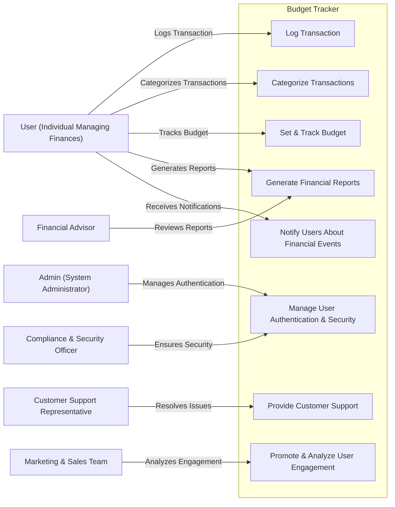

# 📌 Relationships Between Actors and Use Cases

## 👤 User (Individual Managing Finances)
**The User actor** can initiate the **Log Transaction, Categorize Transactions, and Set & Track Budget** use cases, which update financial records and generate reports, supporting the **User’s concern** for a **simple, secure, and efficient financial tracking system**.

---

## 🔧 Admin (System Administrator)
**The Admin actor** manages the **Manage User Authentication & Security** use case, which enforces security protocols and authentication, addressing the **Compliance & Security Officer’s concerns** about **data protection and regulatory compliance**.

---

## 📊 Financial Advisor
**The Financial Advisor actor** can **Generate Financial Reports**, which ensures that financial insights are accurate and reliable, supporting the **Financial Advisor’s concern** for **better financial planning tools for clients**.

---

## 📢 Marketing & Sales Team
**The Marketing & Sales Team actor** engages with the **Promote & Analyze User Engagement** use case, which tracks user behavior and adoption rates, addressing their concern for **improving retention and optimizing promotional strategies**.

---

## 🛡 Compliance & Security Officer
**The Compliance & Security Officer actor** oversees the **Manage User Authentication & Security** use case, which ensures encryption and authentication are implemented, supporting their concern for **compliance with legal and security standards**.

---

## 🎧 Customer Support Representative
**The Customer Support Representative actor** interacts with the **Provide Customer Support** use case to troubleshoot issues and resolve user concerns, addressing the **User’s need for a responsive and accessible support system**.

