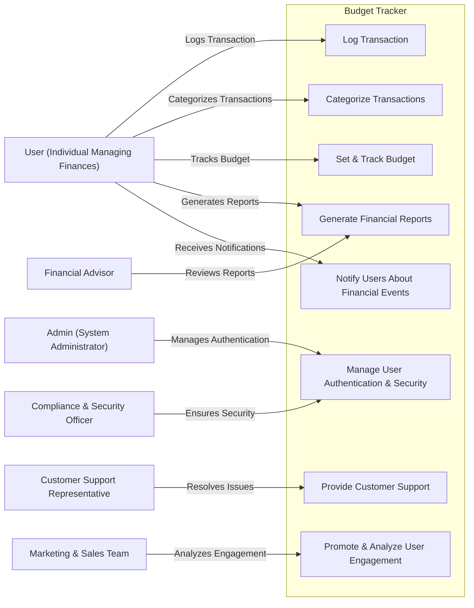

# 📌 Relationships Between Actors and Use Cases

## 👤 User (Individual Managing Finances)
**The User actor** can initiate the **Log Transaction, Categorize Transactions, and Set & Track Budget** use cases, which update financial records and generate reports, supporting the **User’s concern** for a **simple, secure, and efficient financial tracking system**.

---

## 🔧 Admin (System Administrator)
**The Admin actor** manages the **Manage User Authentication & Security** use case, which enforces security protocols and authentication, addressing the **Compliance & Security Officer’s concerns** about **data protection and regulatory compliance**.

---

## 📊 Financial Advisor
**The Financial Advisor actor** can **Generate Financial Reports**, which ensures that financial insights are accurate and reliable, supporting the **Financial Advisor’s concern** for **better financial planning tools for clients**.

---

## 📢 Marketing & Sales Team
**The Marketing & Sales Team actor** engages with the **Promote & Analyze User Engagement** use case, which tracks user behavior and adoption rates, addressing their concern for **improving retention and optimizing promotional strategies**.

---

## 🛡 Compliance & Security Officer
**The Compliance & Security Officer actor** oversees the **Manage User Authentication & Security** use case, which ensures encryption and authentication are implemented, supporting their concern for **compliance with legal and security standards**.

---

## 🎧 Customer Support Representative
**The Customer Support Representative actor** interacts with the **Provide Customer Support** use case to troubleshoot issues and resolve user concerns, addressing the **User’s need for a responsive and accessible support system**.

---
 

# 📌 Use Case Specifications

## **Use Case 1: Log Transaction**
**🎭 Actor:** User (Individual Managing Finances)  
**✅ Precondition:** User is authenticated and has access to their financial dashboard.  
**📌 Postcondition:** A new transaction (income/expense) is recorded, and the account balance updates in real-time.  

### **🔄 Basic Flow:**
1. The user selects **"Add Transaction"** from the dashboard.
2. The system prompts the user to enter details (**amount, category, date, and description**).
3. The user confirms the entry.
4. The system **validates and saves** the transaction.
5. The system updates the **user’s balance** accordingly.
6. A **confirmation message** is displayed.

---

## **Use Case 2: Categorize Transactions**
**🎭 Actor:** User (Individual Managing Finances)  
**✅ Precondition:** User has at least one recorded transaction.  
**📌 Postcondition:** The transaction is assigned to a category, and financial summaries reflect the update.  

### **🔄 Basic Flow:**
1. The user selects a transaction to edit.
2. The system presents available **categories** (e.g., **"Food," "Rent," "Utilities"**).
3. The user selects or creates a **custom category**.
4. The system updates the transaction.
5. The updated category appears in reports.

---

## **Use Case 3: Set & Track Budget**
**🎭 Actor:** User (Individual Managing Finances)  
**✅ Precondition:** User has defined at least one category for budgeting.  
**📌 Postcondition:** A budget is set, and the system tracks expenses against it.  

### **🔄 Basic Flow:**
1. The user selects **"Set Budget"** from the dashboard.
2. The system prompts the user to enter **budget limits per category**.
3. The user confirms the budget.
4. The system **saves and tracks** transactions against the set budget.
5. If spending exceeds **80% of the budget**, the system **triggers an alert**.

---

## **Use Case 4: Generate Financial Reports**
**🎭 Actor:** User, Financial Advisor  
**✅ Precondition:** User has recorded financial transactions.  
**📌 Postcondition:** A financial report is generated and available for viewing/export.  

### **🔄 Basic Flow:**
1. The user selects **"Generate Report"**.
2. The system prompts the user to choose a **time range** (e.g., **weekly, monthly, yearly**).
3. The system retrieves relevant **transaction data**.
4. A **visual summary** of income, expenses, and budget adherence is displayed.
5. The user can **export the report** as a **PDF or CSV file**.

---

## **Use Case 5: Manage User Authentication & Security**
**🎭 Actor:** Admin, Compliance & Security Officer  
**✅ Precondition:** User attempts to log in or register.  
**📌 Postcondition:** User is authenticated, and security measures are enforced.  

### **🔄 Basic Flow:**
1. User enters **email and password** to log in.
2. System **validates credentials** and checks authentication method (**password, OAuth, MFA**).
3. If credentials are correct, **access is granted**.
4. If **MFA is enabled**, the system sends a **verification code**.
5. The system **logs authentication history** for security audits.

---

## **Use Case 6: Notify Users About Financial Events**
**🎭 Actor:** System, User  
**✅ Precondition:** Notifications are enabled in user settings.  
**📌 Postcondition:** User receives a notification about a financial event.  

### **🔄 Basic Flow:**
1. A **trigger event** occurs (**budget exceeded, bill due, low balance**).
2. The system **generates a notification** based on user settings.
3. The user receives a **push notification or email alert**.

---

## **Use Case 7: Provide Customer Support**
**🎭 Actor:** Customer Support Representative  
**✅ Precondition:** User submits a support request.  
**📌 Postcondition:** The issue is logged and tracked until resolution.  

### **🔄 Basic Flow:**
1. The user selects **"Contact Support"** from the app.
2. The system presents support options (**FAQ, live chat, email request**).
3. The user describes the issue and submits a request.
4. The system assigns a **support representative**.
5. Support representative provides **assistance** and updates the ticket.
6. The system **notifies the user** when the issue is resolved.

---

## **Use Case 8: Promote & Analyze User Engagement**
**🎭 Actor:** Marketing & Sales Team  
**✅ Precondition:** User activity data is available.  
**📌 Postcondition:** The system generates insights on user behavior and engagement.  

### **🔄 Basic Flow:**
1. **Marketing & Sales Team** accesses the **"User Engagement Dashboard"**.
2. The system retrieves data on **active users, session duration, feature usage, and retention rates**.
3. The system **displays charts** and key engagement metrics.
4. The team **analyzes trends** and refines marketing strategies.

---

## **📌 Summary**
This document provides a **detailed breakdown of key use cases** in the **Minimalist Budget Tracker**, covering **transaction management, budgeting, security, reporting, support, and user engagement**. 🚀  
Each use case outlines **preconditions, postconditions, main success flows, and alternative paths**, ensuring a **comprehensive system design**.

