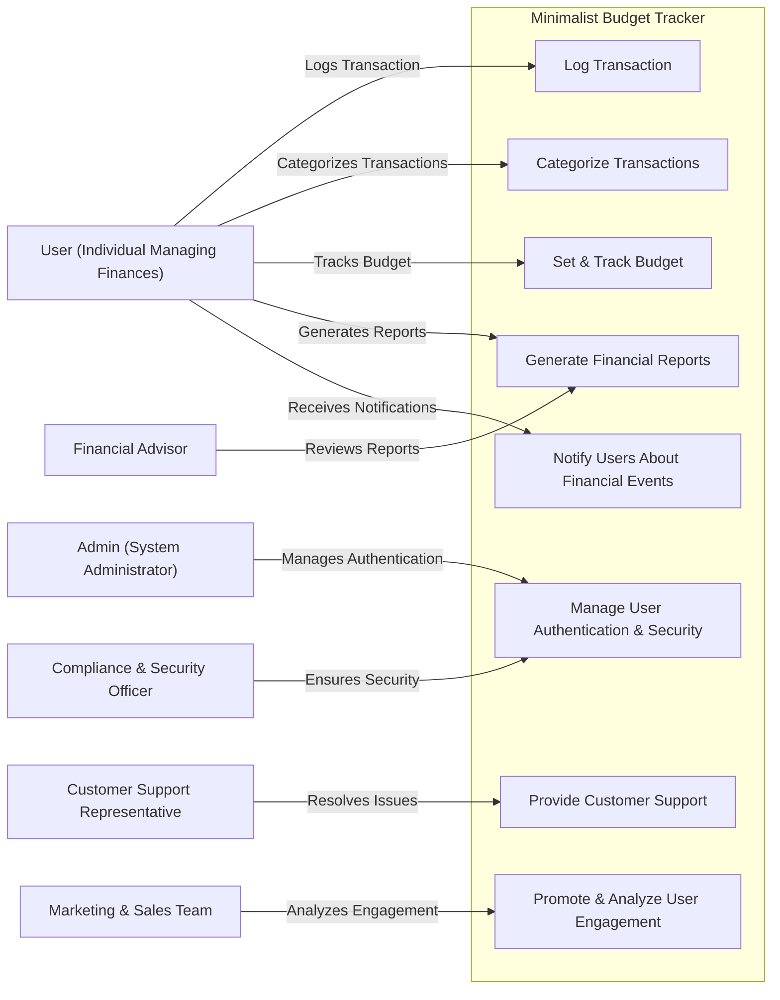

```mermaid
graph LR
  %% Define actors on the left
  User["User (Individual Managing Finances)"]
  Admin["Admin (System Administrator)"]
  FinancialAdvisor["Financial Advisor"]
  MarketingTeam["Marketing & Sales Team"]
  ComplianceOfficer["Compliance & Security Officer"]
  SupportRep["Customer Support Representative"]

  %% Define system boundary on the right
  subgraph BudgetSystem["Minimalist Budget Tracker"]
    A["Log Transaction"]
    B["Categorize Transactions"]
    C["Set & Track Budget"]
    D["Generate Financial Reports"]
    E["Manage User Authentication & Security"]
    F["Notify Users About Financial Events"]
    G["Provide Customer Support"]
    H["Promote & Analyze User Engagement"]
  end

  %% User interactions
  User -- Logs Transaction --> A
  User -- Categorizes Transactions --> B
  User -- Tracks Budget --> C
  User -- Generates Reports --> D
  User -- Receives Notifications --> F

  %% Admin interactions
  Admin -- Manages Authentication --> E

  %% Financial Advisor interactions
  FinancialAdvisor -- Reviews Reports --> D

  %% Marketing Team interactions
  MarketingTeam -- Analyzes Engagement --> H

  %% Compliance Officer interactions
  ComplianceOfficer -- Ensures Security --> E

  %% Support Representative interactions
  SupportRep -- Resolves Issues --> G
```

